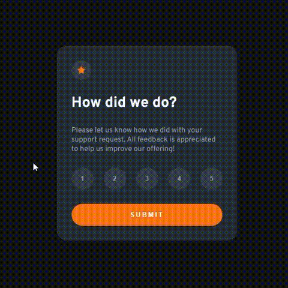

# Interactive rating component - Frontend Mentor

Solução do desafio [Interactive rating component](https://www.frontendmentor.io/challenges/interactive-rating-component-koxpeBUmI), do Frontend Mentor.

### Vídeo do projeto

### Links

- [Link do projeto](https://lichtle.github.io/interactive-rating-component-main/)
- [Solução no Frontend Mentor](https://www.frontendmentor.io/solutions/interactive-rating-component-rCfdf2tGCy)

## Desafios

Os maiores desafios foram a implementação do JS, interação do JS com HTML (DOM) e responsividade, pois foi uma das primeiras vezes que apliquei os conceitos de mobile first.

## Coisas que aprendi

- Mobile First;
- DOM;
- Higher Order Functions.

## Futuro do projeto

- Refatorar o código;
- Melhorar o responsivo.
